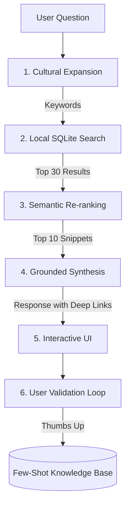

# AI Legal Assistant - Implementation Guide

**Version:** 2.0 (Gemini 2.0 Flash - Intelligence Upgrades)
**Date:** January 1, 2026

## Overview

The AI Legal Assistant is a **Hybrid Semantic RAG (Retrieval-Augmented Generation)** system. It provides accurate, grounded legal information by bridging the gap between natural Guyanese language and formal Statute Law.

## Architecture

The system uses a **multi-stage reasoning process** to ensure accuracy and relevance.

### 1. The Knowledge Base (Local)
*   **Storage:** SQLite Database (`constitution.db`)
*   **Content:** 
    *   Constitution of Guyana (931 Articles)
    *   459 Acts of Parliament (46,558 Sections)
*   **Indexing:** FTS5 (Full-Text Search 5)

### 2. The Intelligence Upgrades (V2.0)

#### A. Semantic Hybrid Search (Re-ranking)
Instead of relying solely on keywords, the system now fetches a broad pool of **30 results** and uses a secondary AI call to "re-rank" them. This ensures that sections related by **meaning** (not just matching words) are prioritized for the final answer.

#### B. Cultural & Slang Calibration
The system includes a dedicated **Guyanese Legal Dictionary** mapping that translates local terms to formal law:
*   *"Child money"* -> Maintenance Act
*   *"Papers for land"* -> Deeds Registry / Transport
*   *"Lock up"* -> Fundamental Rights (Arrest/Detention)

#### C. Few-Shot Learning (Feedback Loop)
The system "learns" from high-quality interactions.
*   **Thumbs Up:** Stores the query/response in a `ai_feedback` table.
*   **Context Injection:** Successful examples are injected back into the AI's prompt as "Few-Shot" guidance for future similar queries.

---

## Data Flow & Prompt Engineering

### Step 1: Cultural Expansion
Resolves slang and conversation history (pronouns/follow-ups) into legal keywords.

### Step 2: Retrieval & Re-ranking
1.  Keyword search finds top 30 potential matches.
2.  Gemini evaluates the 30 snippets and selects the 10 most semantically relevant.

### Step 3: Interactive Synthesis
The final response is generated with **Interactive Deep Links**. 
*   **Format:** `[Source X](lawpal://open?docId=...&chunkId=...)`
*   **Result:** Users can tap citations to jump directly to the specific section in the PDF reader.

---

## User Experience Features

| Feature | Implementation |
|---------|----------------|
| **Context Retention** | Tracks last 5 messages for natural follow-up questions. |
| **Suggested Questions** | AI generates 3 logical next steps as clickable chips. |
| **Feedback UI** | Thumbs Up (validates), Thumbs Down (flags), Flag (reports errors). |
| **Markdown Support** | High-readability formatting with bolding and headers. |

---

## File Structure

| File | Purpose |
|------|---------|
| `src/services/AIService.ts` | The Reasoning Engine (Search expansion, Re-ranking, Synthesis). |
| `src/screens/ChatScreen.tsx` | The UI (History, suggestions, deep-link handling). |
| `src/db/database.ts` | The Data Layer (FTS5 search, feedback persistence). |
| `src/db/migrations.ts` | Database schema updates (Migration 3: `ai_feedback` table). |

---

## Future Roadmap

### 1. Vector Embeddings (Option 1 - Part 2)
*   Transition from "Re-ranking" to local vector embeddings for 100% offline semantic search.

### 2. Case Law Integration
*   Index Guyana High Court and CCJ judgments to provide judicial interpretation alongside statutes.

### 3. Voice-to-Voice
*   Full integration of Whisper (Speech-to-Text) and TTS for accessible legal aid.

